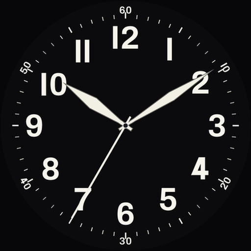
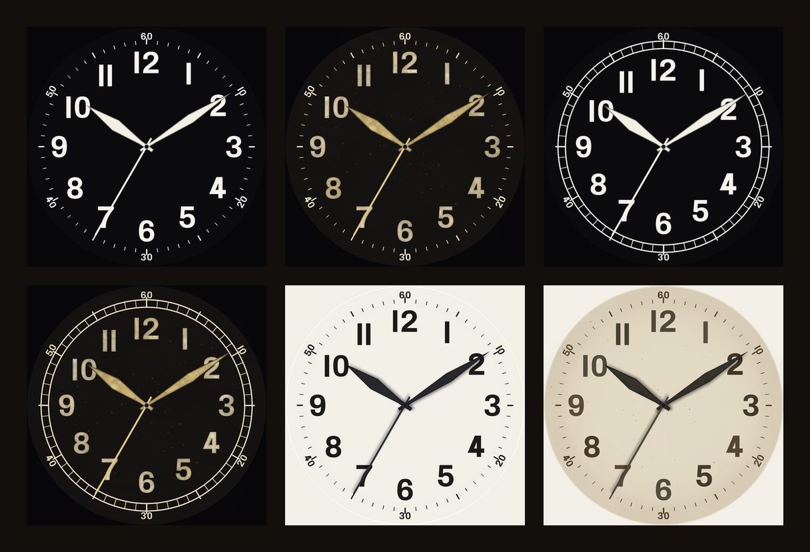

# idlewait

Small, carefully made apps for Wear OS.

---

## A-11 Field

This watch face is inspired by the A-11 watch issued by the US military during
World War II. A-11 watches were manufactured by Bulova, Elgin, and Waltham from
a military spec and issued to service members. It is often called "the watch that
won the war." It brings that clean, legible, no-nonsense dial to your Wear OS
watch.

The A-11 was built to a government specification but had variations in
manufacturing, so this face captures the details those watches shared: a
high-contrast dial, bold Arabic numerals, a full minute track with numbered
five-minute markers, a center sweep seconds hand, and slim tapered hands.

 

Customize it from the watch face editor:

- **Dial style** — Black, Black railroad (twin concentric "railroad track" minute
  ring), or White.
- **Condition** — New issue (crisp and factory-fresh) or Antique patina (a warmed
  dial with aged-tan lume, subtle foxing, and mottling).

Six looks in all, from a pristine new field watch to a well-worn vintage piece.
No ads, no trackers, and no permissions — it simply shows the time, and it is
built with the Watch Face Format for efficient, battery-friendly performance.

<!-- TODO: replace with the public Play Store listing URL at launch.
     A-11 Field is currently in closed testing; there is no public link yet. -->
_Coming soon to Google Play._

---

## About

idlewait makes small, focused apps — the kind that do one thing well and stay
out of the way. Everything here is built to be private by default: no accounts,
no tracking, no data collection.

## Contact

Questions or feedback: [scottyfred@gmail.com](mailto:scottyfred@gmail.com)
